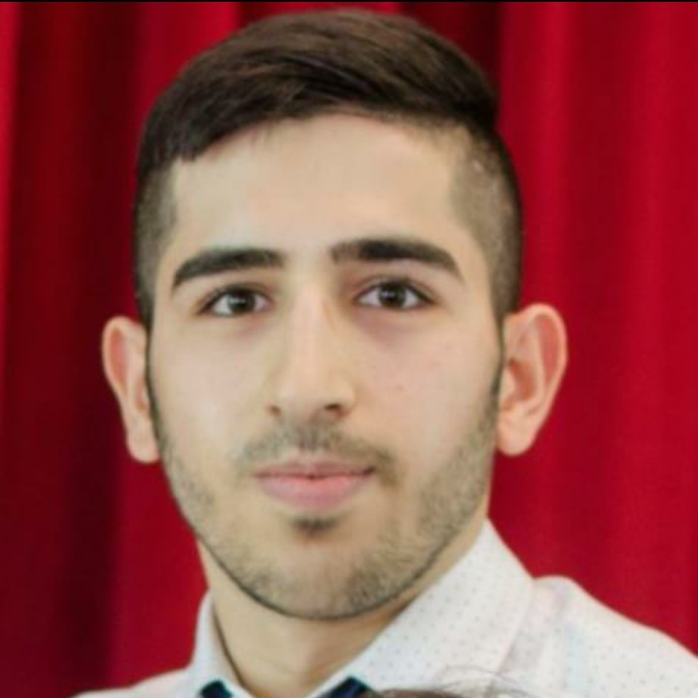

# Team Overview 

- Github Profile: _Insert profile here_
- _n_ th year _insert major_
- _Interests and hobbies_
- _Fun fact_

### Neelay Joglekar (Team Co-Lead)

- Github Profile: [https://github.com/neelay-j](https://github.com/neelay-j)
- 3rd year Computer Engineering major
- Interested in robotics, research, badminton, and hanging out with friends
- Fun fact: I can moonwalk!

### Yash Puneet (Team Co-Lead)

- Github Profile: [https://github.com/yashpuneet](https://github.com/yashpuneet)
- Hi! I am a third year Computer Engineering major and Psychology minor
- I am interested in Robotics, Automation systems and Animal Cognition. On a
  non-academic note, I love hiking and writing short fictional stories.
- One fun fact about me is that I love talking to animals, especially when
  volunteeing at animal shelters and endangered animal reserves (My profile
  picture is actually me at the "Free the Bears" Sanctuary in Cambodia).

### Ojeen Gammah

- Link to my personal Github: https://github.com/ojeengammah
- My name is Ojeen Gammah, I am a senior at UCSD and expected to graduate next fall with a B.S in Computer science. My interest lies in AI as well as autonomous vehicles. However, I am open to any area within the computer science field. I am most familiar with C++/Python/Java. In my extra time, I like to play tennis and soccer. I am very excited about this particular class because I have not done much agile method nor any harness test. Looking forward to this class. Please feel free to ask any question

### Kevin Zhang
  

- Link to my personal Github: https://github.com/KevinZ0217
- I’m Kevin Zhang, a third year undergraduate student majoring in Cognitive Science and Math-Computer Science. I’m interested in neuroscience, machine learning, and I’m also a Brain-Computer interface enthusiast. Moreover, I’m interested in software engineering, and I’m trying to figure out the principles that define a good software engineer in this class. Outside of academics, I love beatboxing, speedcubing, FPS gaming, and table tennis.
