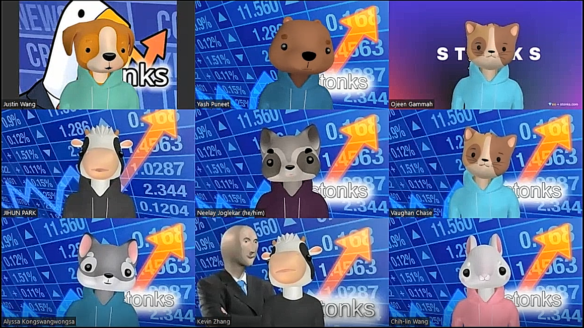
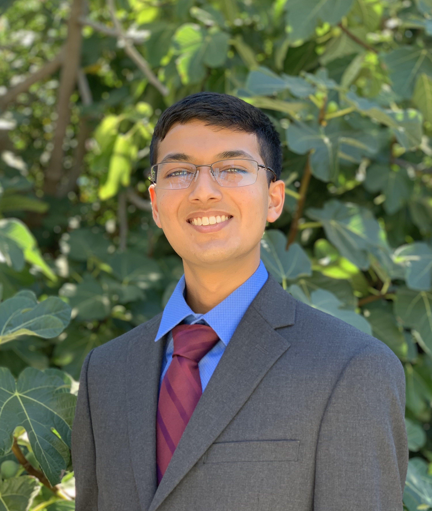
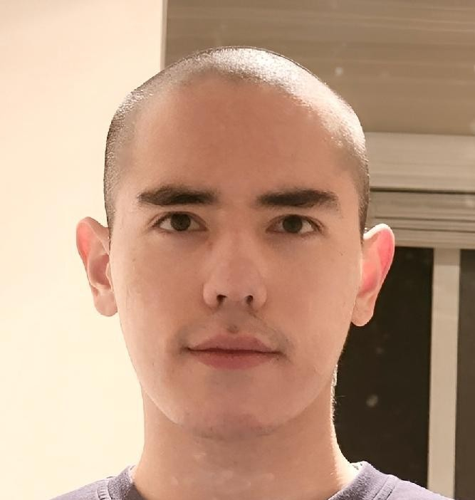
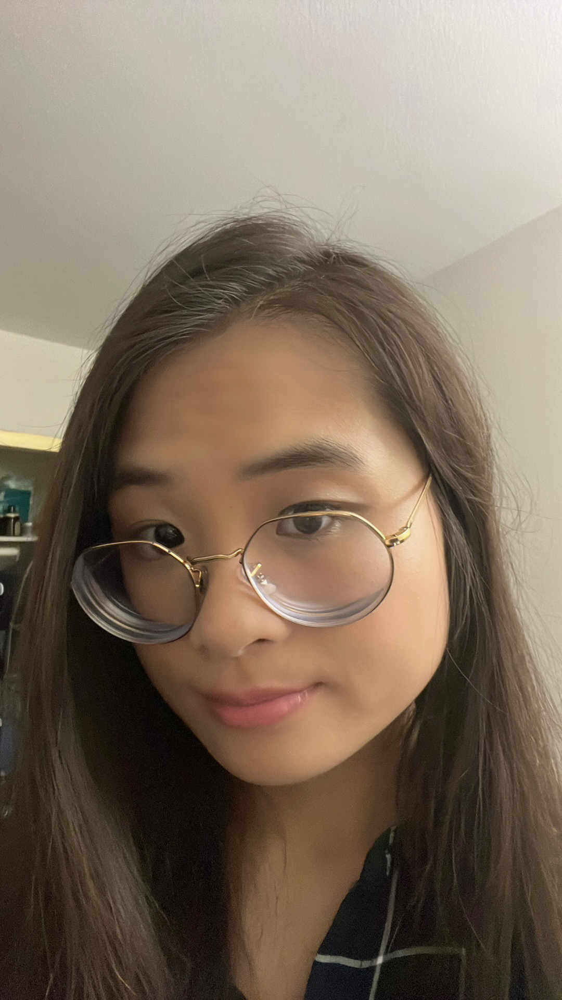
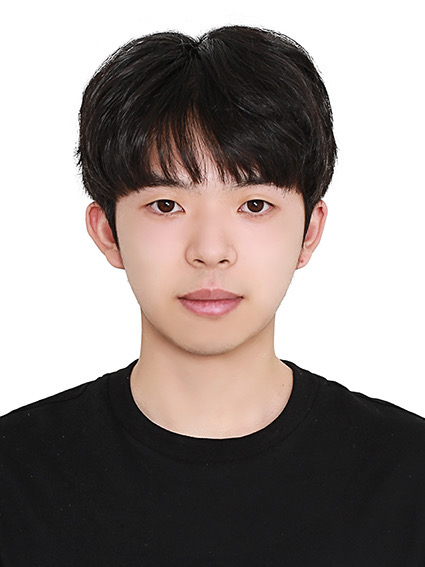

# Team Stonks

Hello! We are Team Stonks - Serious and Funny through teh highs and lows!

## Our Values
As a team, we strive:
- Trust our fellow team members to complete tasks to teh best of ou abilities
- Openly communicate feedback directly but with consideration for each other's feelings
- Deliver high quality products to our end-users to ensure happiness and satisfaction

### Neelay Joglekar (Team Co-Lead)

- Github Profile: [https://github.com/neelay-j](https://github.com/neelay-j)
- 3rd year Computer Engineering major
- Interested in robotics, research, badminton, and hanging out with friends
- Fun fact: I can moonwalk!

### Yash Puneet (Team Co-Lead)

- Github Profile: [https://github.com/yashpuneet](https://github.com/yashpuneet)
- Hi! I am a third year Computer Engineering major and Psychology minor
- I am interested in Robotics, Automation systems and Animal Cognition. On a
  non-academic note, I love hiking and writing short fictional stories.
- One fun fact about me is that I love talking to animals, especially when
  volunteeing at animal shelters and endangered animal reserves (My profile
  picture is actually me at the "Free the Bears" Sanctuary in Cambodia).

### Ojeen Gammah

- Link to my personal Github: [https://github.com/ojeengammah](https://github.com/ojeengammah)
- Senior at UCSD and expected to graduate next fall with a B.S in Computer science
- My interest lies in AI as well as autonomous vehicles. However, I am open to any area within the computer science field
- Most familiar with C++/Python/Java
- In my extra time, I like to play tennis and soccer
- I am very excited about this particular class because I have not done much agile method nor any harness test. Looking forward to this class. Please feel free to ask any question

### Vaughan Chase

- Github Profile: [https://github.com/vchase209](https://github.com/vchase209)
- Senior Computer Science major
- Interested in video games, music, math, and philosophy
- Fun fact: I can kip-up

### Justin Wang

- Github Profile: [https://github.com/jw11142002](https://github.com/jw11142002)
- 2nd year Compuer Science major
- Interested in web dev, badminton, and speedsolving all kinds of rubik's cubes
- Fun fact: I can memorize and solve a 3x3 rubik's cube in about 2 minutes!

### Kevin Zhang

  

- Link to my personal Github: [https://github.com/KevinZ0217](https://github.com/KevinZ0217)
- Third year undergraduate student majoring in Cognitive Science and Math-Computer Science
- Interested in neuroscience, machine learning, and I’m also a Brain-Computer interface enthusiast
- Also interested in software engineering, and I’m trying to figure out the principles that define a good software engineer in this class
- Outside of academics, I love beatboxing, speedcubing, FPS gaming, and table tennis.

### Alyssa Kongswangwongsa

- Githug Proflie:[https://github.com/Arisan39](https://github.com/Arisan39)
- 4th year Mathematics-Computer Science major
- Interested in Web Development, Software Engineering, learning how to play bass and customizing keyboards
- Fun Fact: I'm working at UCSD Bookstore catching shoplifters

### Jihun Park

- Github Profile: [https://github.com/jip002](https://github.com/jip002)
- 3rd year Computer Engineering
- Swimming, drawing, watching movies
- I love to make tiramisu at home

### Chih-Lin (Linda) Wang

- Github Profile: [https://github.com/linda89821](https://github.com/linda89821)
- 4th year Computer Science
- Interested in computer graphics, VR, AR, and Metaverse.
- Fun fact: I love figure skating but still can't spin.
